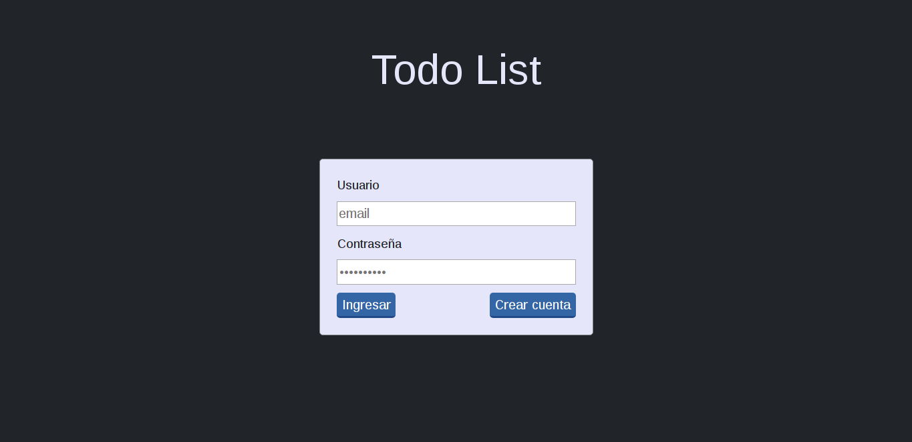
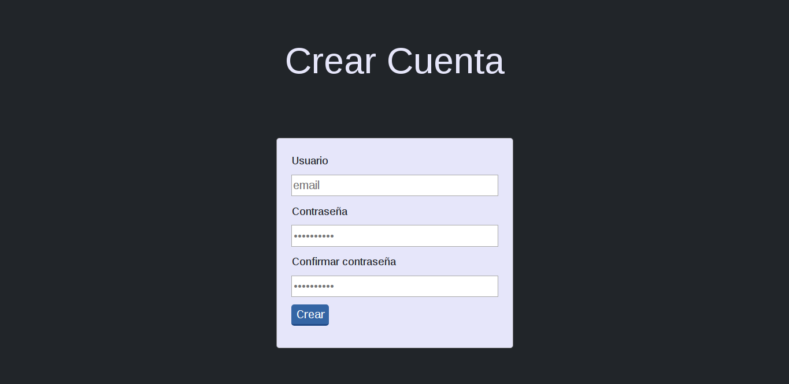
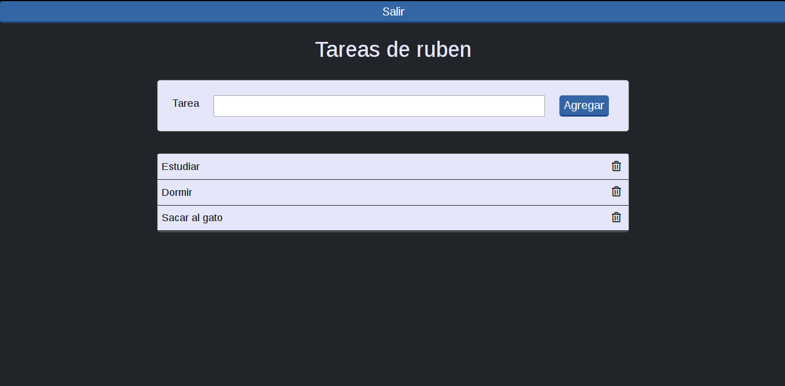

# Todo_List

Aplicacion de un Todo List con React, Redux y styled-components.

### Uso:

**Iniciamos UI** <br>
Corremos:
```
$ npm install
$ npm start
```

---------------------------------
Al iniciar la aplicación tenemos la pantalla de bienvenida.

<p align="center">
  
</p>

Por defecto hay un usuario registrado con el que podemos iniciar:

  email: ruben@mail.com <br>
  contraseña: 1234

También podemos registrar nuevos usuarios.

<p align="center">
  
</p>

Una vez ingresamos tenemos la patalla con la lista de tareas, y un formulario para crear nuevas tareas.

<p align="center">
  
</p>

Podemos borrar tareas en el icono de papelera al lado izquierdo de cada tarea, y para salir de la aplicación tenemos el botón superior.<br>

Las pruebas serán realizadas con Jest, pero aun estan pendientes.